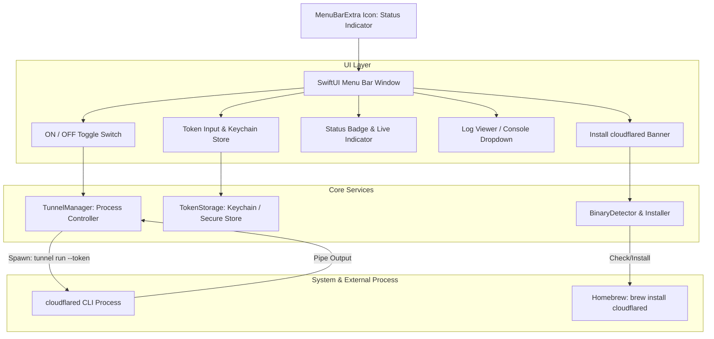

# Implementation Plan: Cloudflare Tunnel Switcher (macOS Menu Bar App)

Aplikasi macOS native yang ultra-ringan berbasis Swift dan SwiftUI untuk menyalakan dan mematikan `cloudflared tunnel` secara on-demand langsung dari Menu Bar (Top Bar), tanpa perlu menginstall tunnel sebagai background system daemon / service.

---

## 1. User Requirements & Goals

1. **On-Demand Control**: Menghindari `cloudflared service install` agar tunnel tidak berjalan terus-menerus di latar belakang tanpa kontrol pengguna.
2. **Eksekusi Tunnel**: Menjalankan perintah `cloudflared tunnel run --token <TOKEN>` saat switch diaktifkan (ON), dan menghentikan proses (SIGINT / SIGTERM) dengan aman saat switch dimatikan (OFF).
3. **Penyimpanan Token**: Token tunnel disimpan secara mandiri & aman (menggunakan macOS Keychain / Preferences).
4. **Native Swift & SwiftUI**: Menggunakan teknologi native Apple modern (`MenuBarExtra`, `Process`, `Combine` / Swift Concurrency).
5. **Menu Bar (Top Bar)**: Aplikasi beroperasi penuh di Menu Bar (status item di top bar) dengan `LSUIElement = true` (tidak mengotori Dock).
6. **Ringan & Cepat**: Memory footprint sangat kecil (< 25MB RAM), binary native tanpa Electron / webview.
7. **Deteksi & Inisiasi Instalasi**:
   - Jika `cloudflared` belum terpasang: deteksi otomatis dan sediakan tombol inisiasi install (via Homebrew `brew install cloudflared`).
   - Jika sudah ada: deteksi lokasinya (misal `/opt/homebrew/bin/cloudflared` atau `/usr/local/bin/cloudflared`) dan langsung siap digunakan.
8. **UI Switch Sederhana**: Indikator status (Stopped / Connecting / Active / Error), Switch Toggle ON/OFF yang intuitif, input token, serta mini log monitor.

---

## 2. Technical Architecture

### 2.1 Technology Stack
- **Language**: Swift 6
- **UI Framework**: SwiftUI (`MenuBarExtra` dengan `.window` style)
- **Target OS**: macOS 13.0+ (Ventura, Sonoma, Sequoia)
- **Process Management**: `Foundation.Process` + `Pipe` untuk I/O stream & signal handling
- **Security & Storage**: Apple Keychain Services / Secure UserDefaults
- **Build System**: Swift Package Manager (SPM) + script bundler untuk membuat `.app` bundle siap pakai

### 2.2 Component Diagram

### 2.3 Key Technical Decisions
1. **Graceful Shutdown**:
   - Saat toggle dimatikan (OFF) atau aplikasi di-quit, proses `cloudflared` harus dikirimi sinyal `SIGINT` (atau `terminate()`) agar koneksi ke Cloudflare edge ditutup secara bersih dan tidak menggantung di cloud.
2. **Stream stdout & stderr**:
   - Parsing output dari `cloudflared` untuk mendeteksi event koneksi sukses (misal `Registered tunnel connection`, `Connection ... registered`) guna mengubah status badge menjadi **Active (Connected)** secara akurat.
3. **Keychain Security**:
   - Token Cloudflare Tunnel cukup sensitif; disimpan di macOS Keychain agar aman dari ekstraksi plaintext.
4. **App Sandbox vs Execution**:
   - Karena aplikasi perlu mengeksekusi binary lokal (`/opt/homebrew/bin/cloudflared` atau `/usr/local/bin/cloudflared`), aplikasi dibuat tanpa sandbox berlebihan agar leluasa menjalankan CLI developer tool.

---

## 3. UI / UX Design Specification

### Menu Bar Icon:
- **OFF**: Icon Cloudflare / awan abu-abu outline (`bolt.slash.fill` atau `cloud`).
- **Connecting**: Awan warna oranye / kuning dengan animasi pulse.
- **ON (Connected)**: Awan warna biru Cloudflare atau hijau menyala (`bolt.fill` atau `cloud.fill`).
- **Error**: Awan dengan tanda seru merah (`exclamationmark.triangle.fill`).

### Menu Bar Popover Content (Lebar ~320px, Tinggi dinamis):
1. **Header**:
   - Logo / Nama: **Cloudflare Switcher**
   - Status Tag: `Running` / `Stopped` / `Connecting...`
2. **Main Switch**:
   - Saklar Toggle besar dengan label jelas `Turn Tunnel ON / OFF`.
   - Disabled jika token kosong atau binary `cloudflared` belum ditemukan.
3. **Token Management**:
   - Secure field untuk token tunnel (`eyJh...`).
   - Tombol Hide/Show & Save.
   - Indikator apakah token sudah tersimpan.
4. **Binary Status & Installer**:
   - Jika terdeteksi: Menampilkan path (misal: `/opt/homebrew/bin/cloudflared`).
   - Jika tidak ditemukan: Notifikasi peringatan + Tombol `Install via Homebrew` (dengan progress indikator saat install berjalan).
5. **Mini Logs / Activity**:
   - Drawer lipat (collapsible) untuk melihat baris log terakhir dari `cloudflared` (memudahkan debugging jika koneksi gagal).
6. **Footer**:
   - Shortcut Settings / Info & tombol `Quit App`.

---

## 4. Work Breakdown & Tasks

### Phase 1: Project Setup & Core Models
- [ ] **Task 1**: Setup Swift Package & Folder Structure (SPM executable, Info.plist untuk Menu Bar app `LSUIElement`).
- [ ] **Task 2**: `TokenStorage` (Implementasi Keychain wrapper aman untuk menyimpan dan mengambil tunnel token).
- [ ] **Task 3**: `BinaryDetector` (Mendeteksi keberadaan `cloudflared` di PATH, `/opt/homebrew/bin`, `/usr/local/bin`, dan fungsi instalasi via `brew`).

### Checkpoint 1: Foundation
- Verifikasi build Swift CLI/Foundation, storage Keychain bekerja, deteksi binary berfungsi.

### Phase 2: Tunnel Process Management
- [ ] **Task 4**: `TunnelManager` (Memulai process `cloudflared tunnel run --token <token>`, stream stdout/stderr, parse status koneksi, dan graceful termination).
- [ ] **Task 5**: Unit/Integration Tests untuk State Machine `TunnelManager` (menangani transisi Idle -> Connecting -> Running -> Stopping -> Stopped -> Error).

### Checkpoint 2: Core Logic
- Verifikasi process dapat dihidupkan dan dimatikan secara programmatic dengan penanganan sinyal yang bersih.

### Phase 3: SwiftUI Menu Bar UI
- [ ] **Task 6**: `MenuBarExtra` App Lifecycle & Menu Bar Item View (icon dinamis sesuai status).
- [ ] **Task 7**: Popover View (Main Switch, Status Badge, Token Input with Keychain integration).
- [ ] **Task 8**: Missing Binary Banner & One-Click Installer Sheet.
- [ ] **Task 9**: Collapsible Log Viewer (menampilkan live stream log koneksi).

### Checkpoint 3: UI & End-to-End
- Aplikasi muncul di top bar, switch berfungsi menghidupkan dan mematikan tunnel dengan token yang diinput, log muncul secara live.

### Phase 4: Packaging & Polish
- [ ] **Task 10**: Build script bundler (`bundle.sh`) untuk mengemas SPM executable menjadi `CloudflareSwitcher.app` (lengkap dengan app icon & Info.plist).
- [ ] **Task 11**: Dokumentasi cara build, jalankan, dan pasang di Launchpad / Applications folder.

---

## 5. Risks and Mitigations

| Risk | Impact | Mitigation |
|------|--------|------------|
| Zombie Process jika app di-force quit | Medium | Pasang hook pada `NSApplication.willTerminateNotification` dan `atexit` untuk membunuh child process `cloudflared` |
| Path `cloudflared` berbeda di tiap Mac (Apple Silicon vs Intel) | Low | Cari di urutan prioritas: `/opt/homebrew/bin/cloudflared`, `/usr/local/bin/cloudflared`, `/usr/bin/cloudflared`, fallback ke `which cloudflared` |
| Token salah / kadaluarsa | Medium | Parse stderr dari `cloudflared` untuk mendeteksi error autentikasi dan langsung ubah status menjadi Error dengan pesan human-readable |
| User belum menginstall Homebrew | Low | Deteksi `brew`; jika tidak ada `brew`, sediakan instruksi download resmi atau link installer binary Cloudflare |
